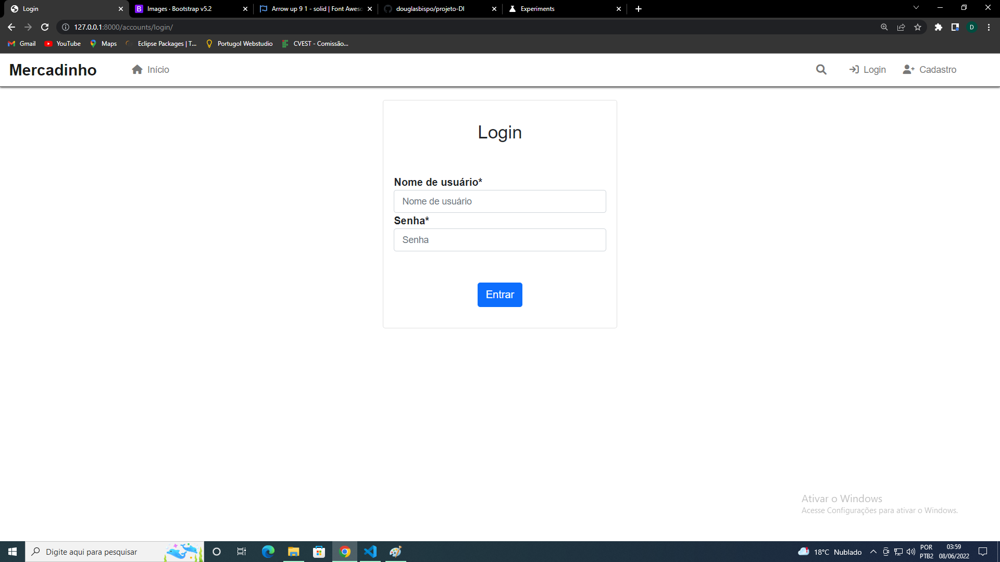
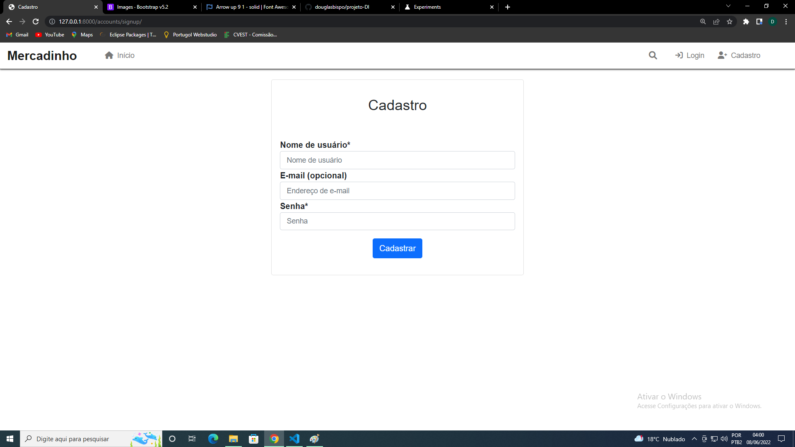
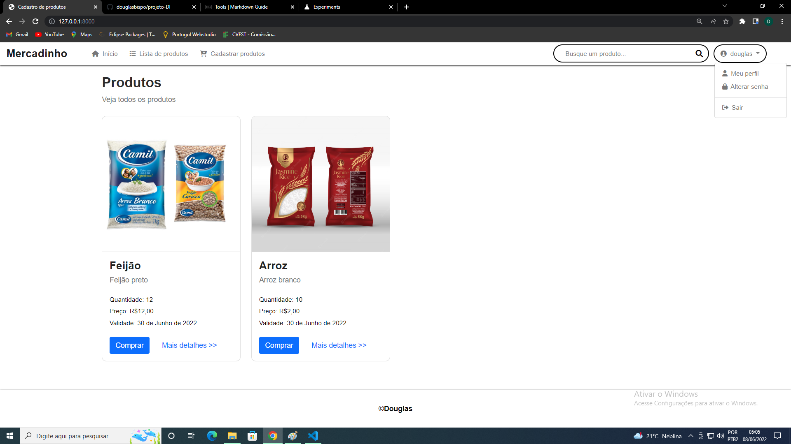
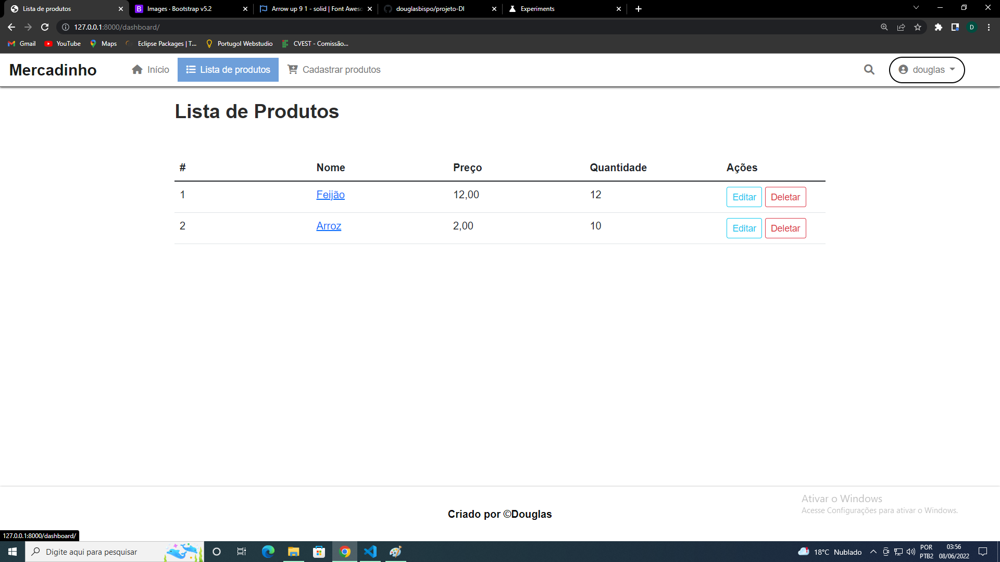
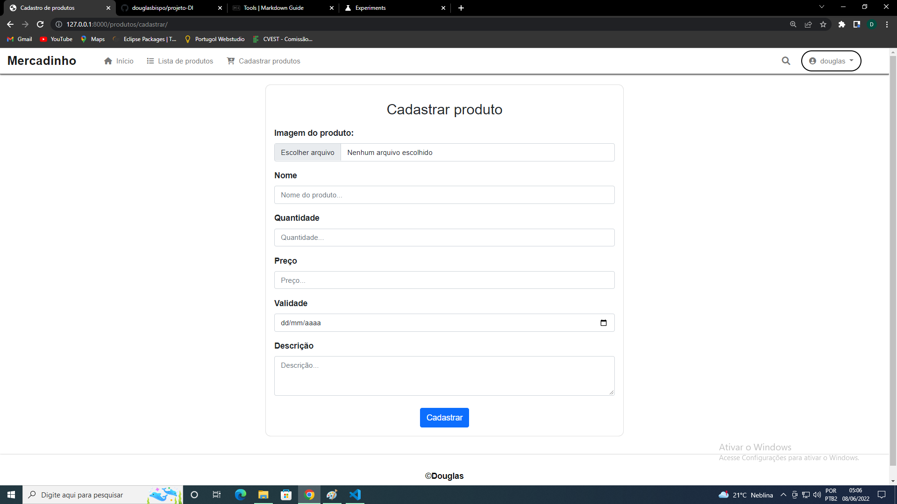
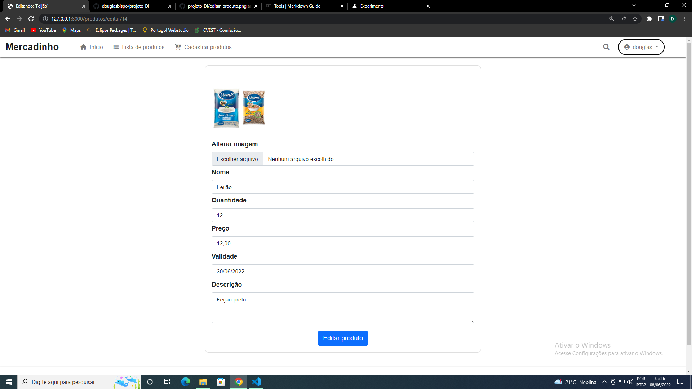

# projeto-DI

Repositório criado para compartilhar a atividade final proposta em design de interfaces (DI).

### Descrição do sistema
O objetivo do projeto é suprir as necessidades básicas de um pequeno mercado, onde os clientes podem ver os produtos e adquiri-los (Funcionalidade está que ainda não está disponível) após se cadastrar e fazer login no sistema. Entretanto, foram implementadas funcionalidades para cadastrar, listar, editar e apagar os produtos, que somente os usuários com permissão possuem acesso.

## Login

## Cadastro de usuário

## Página inicial

## Lista de produtos

## Cadastro de produtos

## editar de produtos

## Mais detalhes

