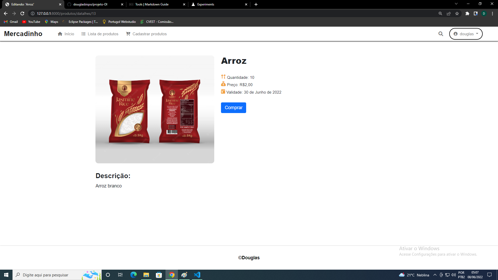

# projeto-DI

Repositório criado para compartilhar a atividade final proposta em design de interfaces (DI).

### Descrição do sistema
O objetivo do projeto é suprir as necessidades básicas de um pequeno mercado, onde os clientes podem ver os produtos e adquiri-los (Funcionalidade está que ainda não está disponível) após se cadastrar e fazer login no sistema. Entretanto, foram implementadas funcionalidades para cadastrar, listar, editar e apagar os produtos, que somente os usuários com permissão possuem acesso.

## Cores utilizadas
**Menu**  
Cor de fundo: #ffffff  
Cor do texto: #787878  
Cor da borda: #494949  
Cor do fundo no hover dos botões: #6e9fda  
Cor do texto no hover dos botões: #ffffff   

**Conteúdo**  
Cor de fundo: #ffffff  
Títulos: #2b2b2b  
subtítulos: #757575  
Cores dos textos: #212121 e #000000  
Cores das bordas: #494949  
Descrições: #757575
Icones: #f2a340
Botões: #0d6efd  

**Rodapé**  
Cor de fundo: #ffffff  
Cor do texto: #0c0c0c  
Cor da borda: #494949  

## Login

## Cadastro de usuário

## Página inicial

## Lista de produtos

## Cadastro de produtos

## editar de produtos

## Mais detalhes

